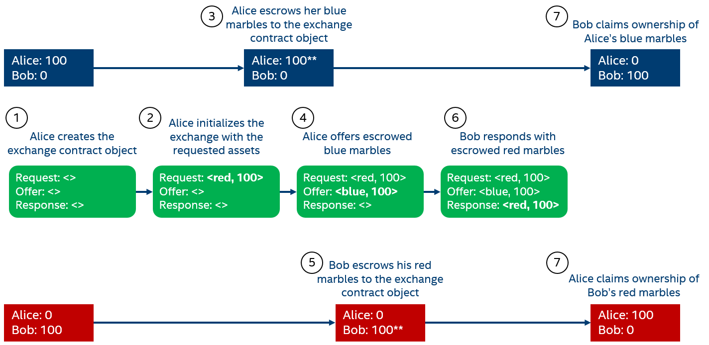
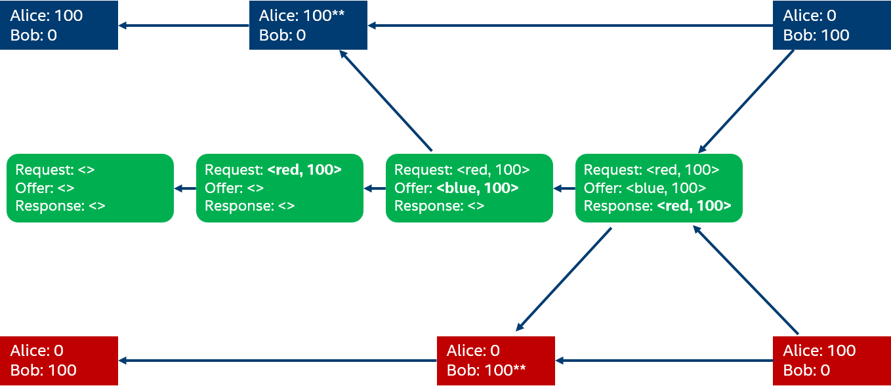

# Asset Exchange Contract Suite #

The asset exchange suite of contracts demonstrates many of the capabilities of the private data
objects technologies.

Three contracts define the data elements of the asset exchange suite: the asset type contract, the
vetting organization contract, and the issuer contract.

An asset type contract object defines a unique, shared identifier for a type of asset and a schema
for the representation for assets of that type. For example, we might define a asset type contract
object for blue marbles. Since the identifier for the contract object is unique, it provides a
shared, unique identifier that can be used to refer to assets that are blue marbles.

A vetting organization contract object manages a list of contract objects authorized to issue
assets of a particular type. While actual vetting of an issuer occurs outside the contract object,
the object provides a means of recording the decision to authorize an issuer. In this way, the
vetting organization contract object provides a root of trust for issuers of a particular asset
type. Continuing the blue marble example, the Blue Marble Players Association might create a vetting
organization object to record the identities of local chapters that may issue blue marble holdings
to their members.

The issuer contract object maintains a balance sheet that captures ownership of assets of a
particular type. The issuer contract allows the creator of the contract object to issue assets (that
is, assign ownership of assets to a particular individual). However, once the initial issuance
occurs, confidentiality of transactions and balances is maintained; in this case, even the creator
of the issuer contract object is not granted the right to examine the quantity of assets owned by an
individual after the initial issuance. Local chapters of the Blue Marble Players Association each
create an issuer contract object to assign ownership of marbles to their members. Once the initial
issuance is complete, members can trade marbles, transfer ownership, or exchange different kinds of
marbles in complete confidentiality. And, for those who trust the Blue Marble Players Association,
those transactions can span local chapters.

While the issuer contract object supports simple ownership transfer, more complex multi-party
exchanges are managed through additional contracts. For example, an exchange contract mediates a
fair exchange of different kinds of marbles (e.g. Alice trades her red marbles for Bob's blue
marbles). More complex exchanges like a blind auction can be implemented as well.

## General Flow ##

The following examples assume that we want to support the exchange of red marbles and blue
marbles. We assume the following identities:

* Blue Marbles Player Association (BMPA) -- an oversight organization that tracks blue marble banks
* Blue Marble Chapter (BMC) -- a local chapter of the BMPA with a large store of blue marbles
* Red Marbles Player Association (RMPA) -- an oversight organization that tracks blue marble banks
* Red Marble Chapter (RMC) --a local chapter of the RMPA with a large store of red marbles
* Alice -- owns a number of blue marbles in in BMC
* Bob -- owners a number of red marbles in RMC

### Setup ###

The asset type and vetting organization contract objects allow for the establishment of a trust
anchor to verify the integrity of exchange operations. For each of the asset types, we need to set
up the asset type, the vetting organization, and one or more issuers. We'll walk through the
sequence of steps necessary for blue marbles; the same step is used to establish the trust anchors
for the red marbles.

1. The BMPA creates an asset type contract object for the blue marbles. The asset type contract
object defines a unique identifier (the current implementation uses the identity of the contract
object itself). In addition, information about the type (e.g. name, description, or a scheme for
data associated with assets of that type) can be provided.

2. The BMPA creates a vetting organization contract object where it can record record and report on
authorizations for organizations that issue blue marbles. When initializing the contract object, the
player association provides the type of asset that will be issued by authorized organizations.

3. Each local chapter that will issue blue marbles creates an issuer contract object. For now, we'll
just create the issuer contract object for the BMC chapter. When it is created, the BMC contract
object holds no authority to issue assets; that is, the issuer contract refuses to issue assets
until the issuer has been authorized. It must recieve that authority from the BMPA. Out of band, the
BMPA verifies the integrity of BMP and records in the BMPA vetting organization contract object
authorization for the BMP issuer contract object to issue blue marble assets. Once the authorization
is complete, the BMC can retreive a representation of the authorization from the BMPA contract
object (the structure of the authorization will be described later). That authorization is then
stored in the BMC issuer contract object.

4. Once the authority from the BMPA has been stored, the BMP may issue blue marble assets to its
members. The current implementation of the issuer contract does not limit the amount of assets that
can be issued; it would be a relatively straightforward extension for the BMPA authorization to
include a maximum number of assets that could be issued; a constraint that would be enforced by the
BMC issuer contract.

### Simple Fair Exchange ###

The fair exchange contract enables a simple, bi-lateral exchange of assets that are managed by
different issuers. For example, Alice and Bob (out of band) decide to exchange 100 red marbles for
100 blue marbles. A fair exchange contract coordinates the exchange of ownership to guarantee that
both sides recieve their assets (or neither does).

*Figure 1. Simple Fair Exchange Transaction Flow*

Figure 1 shows the flow of transactions that take place in a fair exchange. Each of these steps is
described below.

1. Alice creates an exchange contract object.

2. Alice initializes the exchange contract object with the requested number and type of asset
(i.e. the identifier from the red marble asset type contract object). While it is not shown in the
figure, Alice also provides the identity of a vetting organization that she trusts to authorize red
marble issuers. In this case, Alice uses the verifying key for the RMPA object.

3. In preparation for offering her blue marbles for exchange, Alice escrows her holding in the BMC
naming the exchange contract object as the escrow agent. Escrowing the blue marbles ensures that
Alice will not use those marbles in another transaction until the exchange contract object allows
it.

4. Alice records the blue marbles offered for exchange in the exchange contract object. To do this,
she requests a proof of escrow from the BMC. The proof contains three things: details about the
asset (i.e. 100 blue marbles), proof that a vetting organization authorized the issuer to issue blue
marbles, and the escrow claim. The escrow proof is set in the context of a particular instance of
the state of the BMC contract object. That is, the proof of escrow holds if and only if the current
state of the BMC (which captures that Alice's holding has been escrowed) has been committed to the
ledger. This requirement is captured by transaction dependencies that are enforced by the
Coordination and Commit transaction processor in Sawtooth. Figure 2 shows the dependencies between
state update transactions that must be enforced by the TP.

5. Once Alice finishes, Bob can examine the exchange object and see that Alice is offering 100 blue
marbles in exchange for 100 red marbles. Further, Bob can look at the authorization for Alice's
offer to convince himself that the Alice's issuer is appropriately vetted. Once satisfied, Bob goes
through the same process as Alice: he escrows his holding of red marbles, naming the exchange
contract object as the escrow agent.

6. Bob requests a proof of escrow from the RMC and submits it as the response to Alice's
request. The contract in the exchange object verifies the type and quantity of the asset and also
that Alice trusts Bob's issuer (that is, that the RMC was vetted by the RMPA). Assuming Bob's
response is accepted, the exchange contract object enters a "completed" state where no furhter
changes are accepted.

7. To complete the exchange, Bob and Alice independently request a claim from the exchange object
that tells the issuers to transfer ownership of assets. The claim contains information about the old
and new owners, and the identity of the exchange object (which must match the escrow state of the
assets). As with the escrow proof, the claim is situated in the context of a particular state
commit. That is, the claim is not valid unless the completed state of the exchange object is
committed to the ledger.

*Figure 2. Fair Exchange Transaction Dependencies*

## Asset Type Contract ##

The asset type contract provides an identity for asset types that is anchored in the
blockchain. In the current design, there is no particular meaning intrinsically ascribed to the
identity; it simply provides a means to say two things are the same or two things are different.
That being said, this could be extended in the future into a more robust asset class
representation or even use this as a means of certifying issuers of a particular asset class.

### State Update Methods ###

* `(initialize _name _description _link)` -- initialize information about the asset type
    * `_name` -- a short name (32 characters) for the asset type
    * `_description` -- an extended description (256 characters)
    * `_link` -- a URL pointing to additional information (128 characters)

### Immutable Methods ###

* `(get-creator)` -- returns the ECDSA verifying key of the type's creator
* `(get-identifier)` -- returns the unique identifier for the type, currently the contract identifier
* `(get-name)` -- returns the type's short name
* `(get-description)` -- returns the type's description
* `(get-link)` -- returns the type's URL

## Vetting Organization Contract ##

The vetting organization contract is a relatively simple contract that
provides a root for building trust chains of issuers for a particular
asset type. The expectation is that the actual vetting of asset issuers
happens interactively. The vetting organization contract provides a
means of recording decisions to grant authority to asset issuers.

### State Update Methods ###

* `(initialize _asset-type-id)` -- initialize the object with an asset
type identifier, must be invoked by the object creator
    * `_asset-type-id` -- the identifier returned by `(get-identifier)`
      from the asset type contract object
* `(add-approved-key _issuer-verifying-key)` -- record the decision to approve
an asset issuer, must be invoked by the object creator
    * `_issuer-verifying-key` -- the ECDSA verifying key from the asset issuer
      contract object

### Immutable Methods ###

* `(get-authority _issuer-verifying-key)` -- create a proof of authority
  for a previously approved issuer, the structure of the proof of
  authority is described below
    * `_issuer-verifying-key` -- the ECDSA verifying key from the asset issuer
      contract object

* `(get-verifying-key)` -- get the ECDSA verifying key for the contract object

### Proof of Authority ###

A proof of authority captures the data necessary to verify a chain of
trust for a particular asset type. The chain is represented as a tuple:
`(authorized-key dependencies signature parent-authority)` where:

* `authorized-key` is an ECDSA verifying key that is authorized to issue
assets. For example, it might be the verifying key from the Blue Marble
Chapter contract object. The proof of authority implies that a claim of
issuance or escrow is valid if it is signed by the private key
corresponding to the `authorized-key`.

* `dependencies` identifies the state of a contract object that
contextualizes the authority (that is, the state must be committed in
the ledger for the authorization to be valid). `dependencies` is a list
of tuples that contain a contract identifier and state hash. The pair
uniquely identifies a committed state update for the authorizing
contract object.

* `parent-authority` is either a recursive proof of authority or the ECDSA
verifying key of the contract object that serves as the root of the
chain of trust. For example, if the parent authority is a vetting
organization like the BMPA, then the value of the `parent-authority`
field would be the verifing key from the BMPA contract
object. Otherwise, the proof-of-authority object describes the chain of
authority for the parent.

* The `signature` is created by the parent authority using its ECDSA
signing key. The `signature` is computed over the asset type identifier,
the authorized key, and the dependencies.

## Asset Ledger Contract ##

The asset ledger contract is created by an issuer to provide a digital representation for
assets. This might be more accurately described as a ledger of liabilities where the issuer creates
claims against external assets. An asset (or liability) is assigned ownership in the ledge by the
issuer. The asset ledger contract provides operations to assign some subset of the issuance to
another identity in escrow. Escrow differs from ownership in that escrow can be revoked (for now,
solely at the escrow agent's request).

Properties:

* issuer/creator -- identity of the organization that issues the assets
* asset type -- identity of the asset type contract
* balance sheet -- key store for escrow counters

Methods:

* get-balance -- returns the current balance of assets for the requestor
* create -- create a new asset/liability with an initial count, created by the issuer
* transfer -- move assets out of the requestors balance into the balance of another identity
* escrow -- temporarily assign responsibility of the requestor's balance to another identity
* escrow-attestation -- create an attestation that a balance has been escrowed
* disburse -- remove temporary assignment of responsibility from a requestor's balance
* exchange -- transfer assets from an escrowed balance to the requestor's balance

## Fair Exchange Contract ##

The fair exchange contract handles the bi-lateral transfer of asset ownership between ledgers. For
example, Alice gives three blue marbles to Bob in exchange for four red marbles. This transaction
must atomically transfer ownership of assets in the blue marble asset ledger and the red marble
asset ledger. There are several different interactions that would be reasonable for a fair exchange;
this is just one implementation.

Properties:
* asset-one
* asset-two

Methods:
* initialize -- add the keys for the asset to be auctioned and the asset used for bids
* prime-exchange -- establish the identity and exchange parameters
* add-asset -- add the assets to be exchanged to the contract
* get-asset -- get information about the assets to be exchanged
* approve-transfer -- approve the transfer
* transfer-attestatione -- after all approvals are recieved, generate asset transfer attestation
* cancel-transfer -- prior to receiving both approvals, cancel the exchange
* cancel-attestation -- generate an attestation to release the asset from escrow

## Auction Contract ##

The auction contract implements a blind auction of assets. The creator primes the auction with an
asset owned by the creator and escrowed to the auction contract. This asset is the offered
asset. Priming also sets an asset type that will be accepted for bids. Bidders submit a bid that
consists of an asset owned by the bidder and escrowed to the auction contract. Bidders may see the
amount associated with the maximum bid, but not the bidder. They may cancel their bid at any time
until the auction closes. Cancellation of the bid results in an attestation that can be used to
release the asset from escrow. When bidding closes, the winning bidder and the creator of the
auction may request an attestation of ownership transfer that will be presented to the asset
ledger. The creator will receive an attestation that will allow transfer of the winning bid. The
winning bidder will receive an attestation that will allow transfer of the offered asset. Losing
bids can still be cancelled after the auction closes.

Properties:

* creator -- public key of the auction creator
* identity -- public key of the auction contract

Methods:

* initialize -- add the keys for the asset to be auctioned and the asset used for bids
* prime-auction -- add the asset to be auctioned off
* get-offered-asset -- return information about the auction asset
* submit-bid -- submit a bid with proof of escrow
* cancel-bid -- cancel a bid
* cancel-attestation -- return an attestation that a bid has been cancelled
* check-bid -- return the requestor's currently active bid
* max-bid -- return the current maximum bid
* close-bidding -- close bidding
* bidder-attestation -- create the attestation for the bidder to receive the auction asset
* auction-attestation -- create the attestation for the auction creator to receive the winning bid
